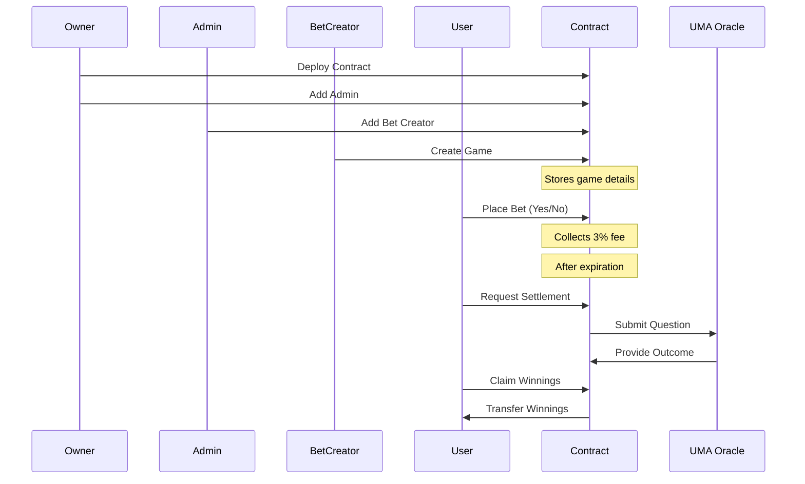

# BettingContract Documentation

Welcome to the BettingContract documentation. This decentralized betting platform allows users to create and participate in binary (Yes/No) bets with trustless settlement using UMA Oracle.

## Quick Links

- [Getting Started](getting-started/prerequisites.md)
- [User Guide](guides/users.md)
- [Technical Documentation](technical/smart-contract.md)

## System Overview

## Key Features

- Binary betting system (Yes/No outcomes)
- Role-based access control
- UMA Oracle integration
- Automated settlement process
- 3% platform fee
