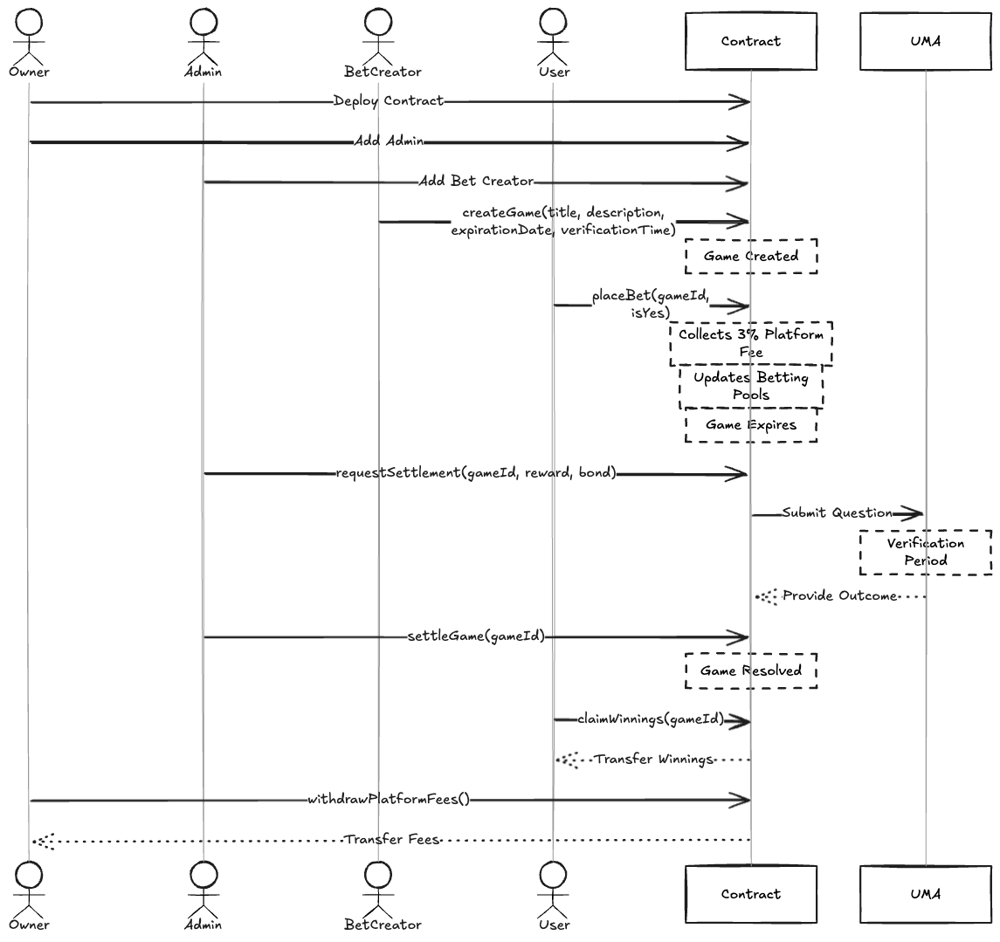

# Architecture & Flow

## System Overview

## How It Works

### 1. Setup Phase

- **Owner** deploys the contract and adds Admins
- **Admins** can add Bet Creators
- **Bet Creators** can create new games

### 2. Betting Phase

- **Bet Creator** creates a game with:
  - Title & Description
  - Expiration Date
  - Verification Time
- **Users** can place bets:
  - Choose Yes/No outcome
  - Send ETH (3% platform fee applied)
  - Funds added to betting pool

### 3. Settlement Phase

- After game expiration:
  - **Admin** requests settlement with UMA Oracle
  - Provides reward and bond in WETH
  - Waits for verification period
  - **Admin** executes settlement with Oracle result

### 4. Distribution Phase

- **Users** can claim winnings if:
  - They bet on correct outcome
  - Game is resolved
  - Haven't claimed yet

## Key Components

- **UMA Oracle**: Provides trustless game resolution
- **WETH**: Used for Oracle rewards and bonds
- **Platform Fee**: 3% on all bets
